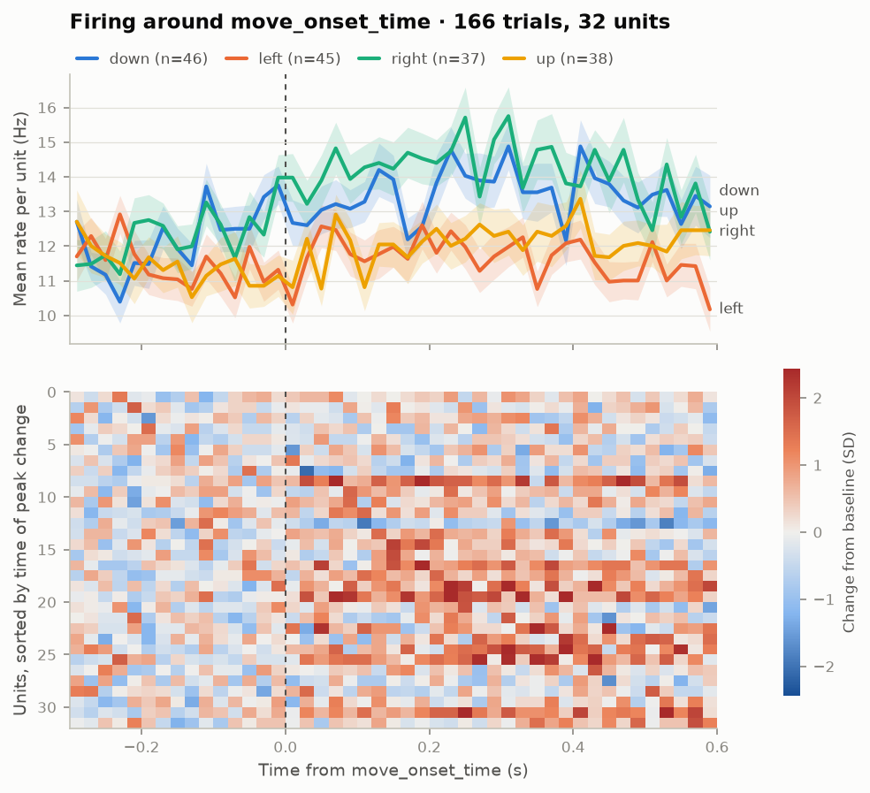
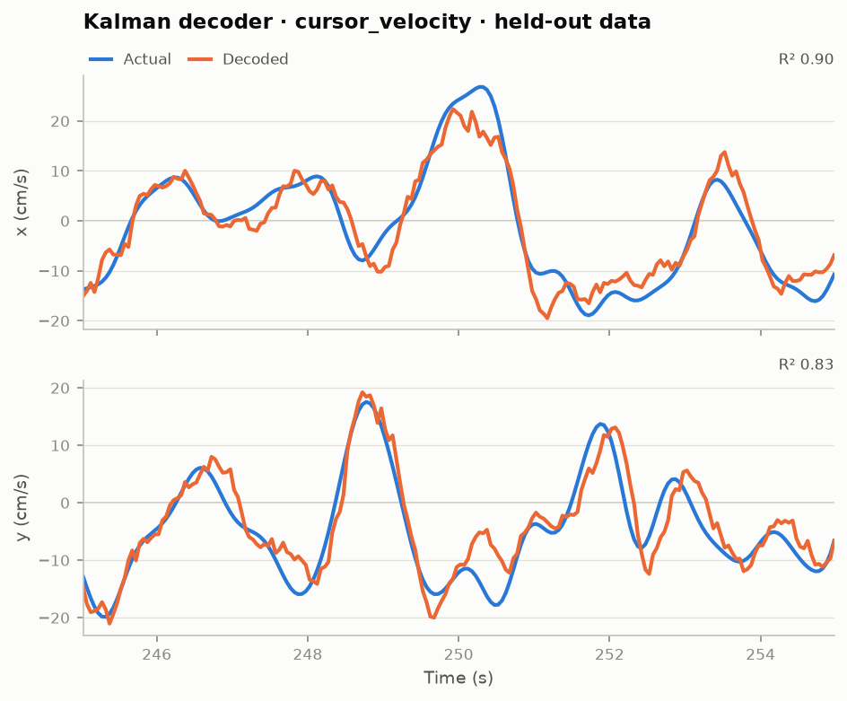

# ephys-mcp

<!-- mcp-name: io.github.happyc0der/ephys-mcp -->

An [MCP](https://modelcontextprotocol.io) server that lets an LLM analyse **intracortical (spike-level) brain-computer-interface recordings**: signal quality, spike detection, firing rates, and cursor-velocity decoding.

Existing BCI MCP servers target scalp EEG. This one targets the kind of data a high-channel-count implant produces, and defines a read-only adapter contract so a live device backend can be added when a vendor publishes an API.

> Research and education software. **Not a medical device. Not for clinical use.**
> Not affiliated with or endorsed by Neuralink Corp. or any other implant manufacturer.

## Example output

Figures from the built-in synthetic source (32 units, 300 s, seed 2), produced by the server's own plot tools.

|  |  |
| --- | --- |
| `plot_psth` grouped by reach direction: population rate per direction (mean ± SEM over 166 trials) above a unit-by-time heatmap of change from baseline | `plot_decoding` after `fit_decoder(kind="kalman")`: decoded against actual cursor velocity on a held-out 10 s window, R² 0.90 (x) and 0.83 (y) |

## Status

v0.5. The planned feature set is complete: local NWB files, local broadband WAV recordings, live Lab Streaming Layer streams, streaming from the DANDI Archive, a synthetic motor-cortex source with ground truth, spike detection, quality metrics, ridge and Kalman decoders, trial-aligned PSTHs, spike sorting, cross-session (FALCON-style) evaluation, latent-factor models (GPFA, PCA), probe geometry, and figures. 24 tools. Bug reports and feature requests go to [GitHub Issues](https://github.com/happyc0der/ephys-mcp/issues).

## Install and run

Needs [uv](https://docs.astral.sh/uv/). No install step: `uvx ephys-mcp` fetches the package and starts the server on stdio.

Claude Code:

```bash
claude mcp add ephys -- uvx ephys-mcp
```

Claude Desktop (`claude_desktop_config.json`):

```json
{ "mcpServers": { "ephys": { "command": "uvx", "args": ["ephys-mcp"] } } }
```

From a checkout, use `uv run ephys-mcp` instead, or `uv --directory /path/to/ephys-mcp run ephys-mcp` in the configs above.

### HTTP transport

For remote clients or hosted agents, serve streamable HTTP instead of stdio:

```bash
EPHYS_MCP_TOKEN='a-long-random-secret' uvx ephys-mcp --http --host 0.0.0.0 --port 8000
```

Every request must then carry `Authorization: Bearer <token>`. The server refuses to bind to a non-loopback address without a token, and tokens must be at least 16 characters. Put TLS in front of it (a reverse proxy) before exposing it beyond a private network: the token travels in clear text otherwise. On loopback the token is optional, so `ephys-mcp --http` alone serves `http://127.0.0.1:8000/mcp` for local testing.

Then ask, for real data: *"Find a small motor cortex dataset on DANDI, open it, and tell me how well hand velocity can be decoded."*
Or offline: *"Open a synthetic session, check signal quality, fit a Kalman decoder and show me a decoded window."*

## Data sources

| Source | What it opens |
| --- | --- |
| `synthetic` | Simulated units tuned to cursor velocity, with broadband signal and ground truth |
| `nwb` | A local `.nwb` file (`params.path`) |
| `wav_dir` | Local broadband WAV (`params.path`): a folder of mono clips, one channel each, or one multi-channel file |
| `lsl` | A live [Lab Streaming Layer](https://labstreaminglayer.org) broadband stream on the local network; keeps the most recent `buffer_s` of signal. Needs `uvx --with 'ephys-mcp[lsl]' ephys-mcp` |
| `dandi` | An NWB file streamed from the [DANDI Archive](https://dandiarchive.org) by HTTP range requests; nothing is mirrored |
| `n1_stub` | Not implemented. Documents how a live implant adapter would be written on the same base as `lsl` |

Dataset licence and citation come from the archive and are returned by `open_session`, so the model can attribute the data. Many datasets record only during trials; the server tracks those spans (`recorded_fraction`) and leaves the gaps out of rates and decoding instead of reading them as silence.

WAV samples carry no physical unit, so amplitudes are reported as ADC counts unless you pass `uv_per_count`; every amplitude result names its unit. Clips in a folder are separate recordings, so the server says that timing across those channels is not meaningful. Spike times from WAV are threshold crossings, not sorted units.

Reference results, all simple causal linear baselines rather than state of the art:

- MC_Maze_Small (DANDI 000140, 142 units, last 20% held out, 50 ms bins): ridge R² 0.50, Kalman R² 0.34 for hand velocity.
- FALCON H1 (DANDI 000954, human 7-DoF velocity, 176 channels, 20 ms bins, `eval_mask`): ridge trained on the first held-in day scores R² 0.43 on that day's minival, 0.07 one week later and below zero on the held-out days. That decay is the point of the benchmark; the Kalman filter is unsuitable for this scripted calibration data. FALCON's official test labels are private, so these are not leaderboard scores.

Decoder hyperparameters (ridge strength, the neural lead for Kalman) are chosen by blocked cross-validation inside the training split. Ridge history is 0.5 s of spike counts whatever the bin size.

GPFA is implemented from the paper's equations in numpy and scipy (EM over loadings, offsets, noise and per-factor timescales; no deep-learning dependency), and runs in seconds on a hundred trials. On the simulator, whose true latent is 2-D cursor velocity, it finds two dominant factors that explain velocity with R² 0.95 (PCA: 0.68). On MC_Maze_Small it shows the rotating population trajectory around movement onset that motor cortex is known for. LFADS-class models are out of scope: they need a training run of minutes and a deep-learning stack.

## Tools

| Tool | Purpose |
| --- | --- |
| `list_sources` | Source types and their parameters |
| `search_datasets` | Search DANDI, or list curated intracortical datasets |
| `list_dataset_files` | Licence, citation and NWB files of a DANDI dataset |
| `list_lsl_streams` | LSL streams visible on the network |
| `get_stream_status` | For a live session: buffered span, whether data is arriving, drops |
| `open_session` / `close_session` | Session lifecycle |
| `get_session_info` | Channels, rates, behaviour signals, licence, citation |
| `get_signal_quality` | Noise, SNR, dead/noisy channels |
| `detect_spikes` | Threshold crossings; precision/recall when truth exists |
| `sort_spikes` | Spike-sort a broadband window with spikeinterface (`sort` extra), using probe geometry when known; the session then uses the sorted units |
| `set_probe_geometry` | Supply contact positions for a session whose file has none: Utah, grid, linear, tetrode layouts or explicit coordinates |
| `get_probe` | Contact positions and brain-area labels per channel |
| `plot_probe` | Figure: array map, contacts coloured by firing rate, sorted units per contact |
| `get_firing_rates` | Population rate summary |
| `fit_decoder` | Ridge or Kalman, scored on held-out data; hyperparameters chosen inside the training split |
| `decode_window` | Decoded-vs-true preview for a window |
| `evaluate_cross_session` | Fit on one session, score unchanged on others: does a decoder survive to a later day? Honours FALCON's `eval_mask` |
| `get_psth` | Firing aligned to a trial event, optionally grouped by a trial column or limited to some units |
| `fit_latent_factors` | GPFA (Yu et al. 2009) or PCA on trial-aligned activity: single-trial latent trajectories, variance per factor, timescales, and how well the top factors explain a velocity signal |
| `plot_latent_factors` | Figure: top three factors over time, the factor-1/factor-2 state space, and variance per factor |
| `plot_psth` | Figure: PSTH per group with SEM, above a unit-by-time heatmap of change from baseline |
| `plot_raster` | Figure: spike raster, unrecorded spans shaded |
| `plot_decoding` | Figure: decoded against actual behaviour, one panel per dimension |

Resource: `ephys://sessions`. Prompts: `analyze_session`, `falcon_evaluate`.

Tools return summaries, never raw arrays, so results fit in a model's context.

### Optional extras

| Extra | Adds | Install |
| --- | --- | --- |
| `lsl` | the `lsl` live source | `uvx --with 'ephys-mcp[lsl]' ephys-mcp` |
| `sort` | `sort_spikes` via spikeinterface's built-in sorters (spykingcircus2, tridesclous2); about 330 MB of dependencies | `uvx --with 'ephys-mcp[sort]' ephys-mcp` |

Sorting uses the session's probe geometry, from the file's electrode table or from `set_probe_geometry`, so contacts under 100 µm apart are sorted jointly. This matters on dense probes: on a simulated 20 µm laminar probe, sorting with the true geometry finds the 12 real units, while treating contacts as independent reports 15, counting the same unit again on neighbouring contacts. Without geometry, channels are placed far apart and treated as isolated electrodes. On the simulator, spykingcircus2 recovers every unit with recall above 0.95.

Brain-area labels come from the NWB electrodes table when present (MC_Maze reports PMd and M1); `get_probe` lists them per channel so an analysis can be restricted to one area with the `units` argument. Note that none of the DANDI datasets tried so far stores contact coordinates, so for those `set_probe_geometry` is the way to supply an array layout.

Plot tools return the PNG inline, so a vision-capable model can read the figure, and also save it under `~/.cache/ephys-mcp/plots` (override with `EPHYS_MCP_OUTPUT_DIR`). Figures use a categorical palette checked for colour-blind separation, with direct labels so identity never rests on colour alone.

## Design rules

- **Read-only.** The `NeuralSource` contract has no write, stimulate or configure method. None will be added without a separate safety design.
- **Local by default.** stdio transport, no telemetry. HTTP is opt-in and token-gated. Neural data is sensitive.
- **No bundled third-party data.** See [DATA_LICENSES.md](DATA_LICENSES.md).

## Writing a source adapter

For recordings, subclass `ephys_mcp.sources.base.NeuralSource` (`info`, `read_raw`, `spike_times`, `behavior`). For a live device, subclass `ephys_mcp.sources.live.RingBufferSource` and call `push(samples)` from a reader thread; `sources/lsl.py` is a complete example in about 60 lines, and `sources/n1_stub.py` lists what an implant adapter would additionally need. Register the class in `ephys_mcp/sources/__init__.py`.

Live sessions report time as seconds since open, and only the most recent buffer is readable, so `t_start_s` and `duration_s` move forward.

## Development

```bash
uv run pytest              # offline
uv run pytest -m network   # also streams a real file from DANDI
uv run ruff check .
```

## Citing

See [CITATION.cff](CITATION.cff); GitHub's "Cite this repository" button uses it. Cite the datasets you analyse separately: `get_session_info` returns each one's citation.

## Licence

[CC0 1.0 Universal](LICENSE). The authors waive all copyright and related rights to the extent the law allows. Use it for anything, no attribution required. CC0 does not grant patent or trademark rights.
